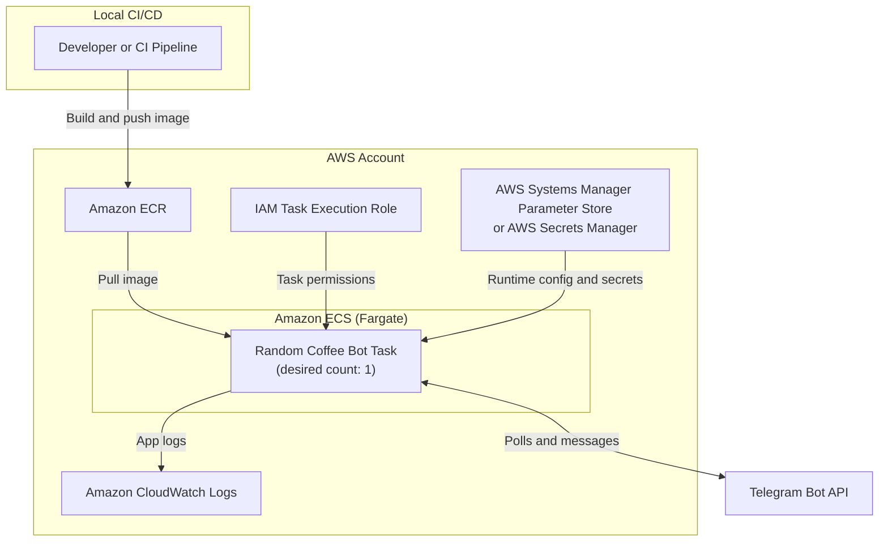

# AWS Deployment Guide (Docker) for Random Coffee Bot

This guide deploys the bot as a container using **Amazon ECR + Amazon ECS Fargate**.

## AWS Solution Architecture



## Prerequisites

- AWS account with permissions for ECR, ECS, IAM, and CloudWatch Logs
- AWS CLI v2 configured locally (`aws configure`)
- Docker installed locally
- Telegram bot token and target chat ID

---

## 1) Build and Push Docker Image to ECR

Set variables:

```bash
export AWS_REGION=us-east-1
export AWS_ACCOUNT_ID=$(aws sts get-caller-identity --query Account --output text)
export ECR_REPO=random-coffee-bot
export IMAGE_TAG=latest
```

Create ECR repository (if not already created):

```bash
aws ecr describe-repositories --repository-names "$ECR_REPO" --region "$AWS_REGION" >/dev/null 2>&1 || \
aws ecr create-repository --repository-name "$ECR_REPO" --region "$AWS_REGION"
```

Authenticate Docker to ECR:

```bash
aws ecr get-login-password --region "$AWS_REGION" | \
  docker login --username AWS --password-stdin "$AWS_ACCOUNT_ID.dkr.ecr.$AWS_REGION.amazonaws.com"
```

Build and push image:

```bash
docker build -t "$ECR_REPO:$IMAGE_TAG" .
docker tag "$ECR_REPO:$IMAGE_TAG" "$AWS_ACCOUNT_ID.dkr.ecr.$AWS_REGION.amazonaws.com/$ECR_REPO:$IMAGE_TAG"
docker push "$AWS_ACCOUNT_ID.dkr.ecr.$AWS_REGION.amazonaws.com/$ECR_REPO:$IMAGE_TAG"
```

---

## 2) Create ECS Cluster

```bash
aws ecs create-cluster --cluster-name random-coffee-bot-cluster --region "$AWS_REGION"
```

---

## 3) Create IAM Roles (one-time)

Create ECS Task Execution role if not present (console is easiest):

- Role name: `ecsTaskExecutionRole`
- Trusted entity: `ecs-tasks.amazonaws.com`
- Attach policy: `AmazonECSTaskExecutionRolePolicy`

For CLI users, ensure the role exists and has that policy attached.

---

## 4) Create CloudWatch Log Group

```bash
aws logs create-log-group --log-group-name /ecs/random-coffee-bot --region "$AWS_REGION" 2>/dev/null || true
```

---

## 5) Register Task Definition

Create `task-definition.json`:

```json
{
  "family": "random-coffee-bot",
  "networkMode": "awsvpc",
  "requiresCompatibilities": ["FARGATE"],
  "cpu": "256",
  "memory": "512",
  "executionRoleArn": "arn:aws:iam::<AWS_ACCOUNT_ID>:role/ecsTaskExecutionRole",
  "containerDefinitions": [
    {
      "name": "random-coffee-bot",
      "image": "<AWS_ACCOUNT_ID>.dkr.ecr.<AWS_REGION>.amazonaws.com/random-coffee-bot:latest",
      "essential": true,
      "environment": [
        {"name": "TELEGRAM_BOT_TOKEN", "value": "<YOUR_BOT_TOKEN>"},
        {"name": "TELEGRAM_CHAT_ID", "value": "<YOUR_CHAT_ID>"},
        {"name": "POLL_DAY", "value": "monday"},
        {"name": "POLL_TIME", "value": "10:00"},
        {"name": "PAIRING_DAY", "value": "wednesday"},
        {"name": "PAIRING_TIME", "value": "10:00"},
        {"name": "DATA_DIR", "value": "/app/data"}
      ],
      "logConfiguration": {
        "logDriver": "awslogs",
        "options": {
          "awslogs-group": "/ecs/random-coffee-bot",
          "awslogs-region": "<AWS_REGION>",
          "awslogs-stream-prefix": "ecs"
        }
      }
    }
  ]
}
```

Replace placeholders and register:

```bash
aws ecs register-task-definition --cli-input-json file://task-definition.json --region "$AWS_REGION"
```

> Note: for production, store secrets in AWS Systems Manager Parameter Store or Secrets Manager.

---

## 6) Run as a Scheduled ECS Task (recommended)

Because the bot runs continuously and schedules work internally, run a **single always-on task**:

```bash
aws ecs run-task \
  --cluster random-coffee-bot-cluster \
  --launch-type FARGATE \
  --task-definition random-coffee-bot \
  --network-configuration "awsvpcConfiguration={subnets=[subnet-xxxx],securityGroups=[sg-xxxx],assignPublicIp=ENABLED}" \
  --region "$AWS_REGION"
```

You can also create an ECS Service with desired count = `1` for automatic restart.

---

## 7) Monitoring and Operations

View running tasks:

```bash
aws ecs list-tasks --cluster random-coffee-bot-cluster --region "$AWS_REGION"
```

Tail logs:

```bash
aws logs tail /ecs/random-coffee-bot --follow --region "$AWS_REGION"
```

Stop task:

```bash
aws ecs stop-task --cluster random-coffee-bot-cluster --task <TASK_ARN> --region "$AWS_REGION"
```

---

## Optional: Deploy on EC2 with Docker Compose

If you prefer EC2 over ECS:

1. Launch Ubuntu EC2 and SSH in.
2. Install Docker + Compose plugin.
3. Clone repo, create `.env`, and run:

```bash
docker compose up -d --build
```

This is simpler, but ECS is the more managed AWS option.
