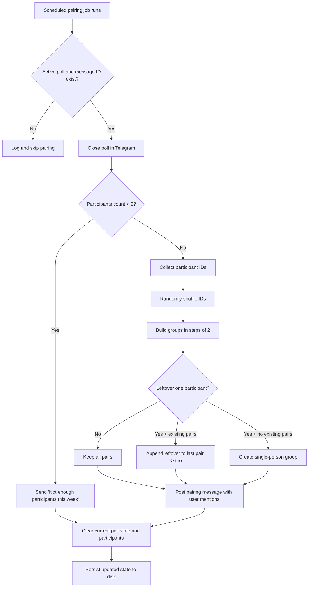

# ITPM Club Random Coffee Bot

A Telegram bot that runs the ITPM community's weekly **Random Coffee** routine:

- sends a participation poll,
- collects opt-ins,
- randomly creates pairs (or one trio when needed),
- posts the weekly matching result in the group.

## Features

- Weekly poll scheduling (configurable day/time).
- Weekly automatic pairing schedule.
- Poll answers persisted on disk.
- Handles restarts without losing active poll context.
- Uses Telegram user mentions for easy introductions.

## Pairing Logic



## Requirements

- Python 3.10+
- A Telegram bot token from [@BotFather](https://t.me/BotFather)
- A Telegram group chat ID

Install dependencies:

```bash
pip install python-telegram-bot==13.15 schedule
```

## Configuration

Set environment variables before running:

- `TELEGRAM_BOT_TOKEN` (required)
- `TELEGRAM_CHAT_ID` (required)
- `POLL_DAY` (optional, default: `monday`)
- `POLL_TIME` (optional, default: `10:00`)
- `PAIRING_DAY` (optional, default: `wednesday`)
- `PAIRING_TIME` (optional, default: `10:00`)
- `TZ` (optional, default: `UTC`; Docker scheduler timezone, e.g. `Europe/Berlin`)
- `DATA_DIR` (optional, default: current directory)

Example:

```bash
export TELEGRAM_BOT_TOKEN="<your_token>"
export TELEGRAM_CHAT_ID="-1001234567890"
export POLL_DAY="monday"
export POLL_TIME="10:00"
export PAIRING_DAY="wednesday"
export PAIRING_TIME="10:00"
export TZ="UTC"
export DATA_DIR="./data"
```

## Run

```bash
python RandomCoffeBot.py
```


## Docker (Local)

1. Create your env file:

```bash
cp .env.example .env
# then edit .env with your TELEGRAM_BOT_TOKEN and TELEGRAM_CHAT_ID
```

2. Start the bot with Docker Compose:

```bash
docker compose up -d --build
```

3. Check logs:

```bash
docker compose logs -f
```

4. Stop the bot:

```bash
docker compose down
```

Data is persisted in `./data` via a bind mount.

## Docker (AWS)

For AWS deployment using Docker (ECR + ECS Fargate), see `AWS_DEPLOYMENT_GUIDE.md`.

## Notes

- The bot uses the process local timezone for scheduling. In Docker, set `TZ` in `.env`.
- For odd participant counts, one trio is created.
- Keep the process running continuously (use systemd, Docker, or a process manager in production).
